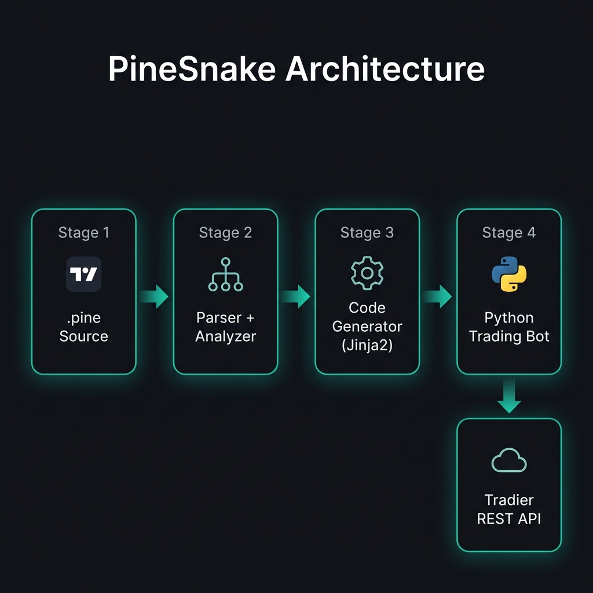
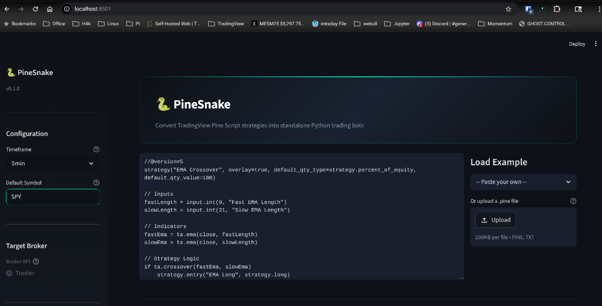

<p align="center">
  
</p>

<h1 align="center">🐍 PineSnake</h1>

<p align="center">
  <strong>Convert TradingView Pine Script strategies into standalone Python trading bots.</strong>
</p>

<p align="center">
  <a href="#quickstart">Quickstart</a> ·
  <a href="#web-ui">Web UI</a> ·
  <a href="#cli-reference">CLI Reference</a> ·
  <a href="#supported-functions">Supported Functions</a> ·
  <a href="#safety-features">Safety Features</a>
</p>

<p align="center">
  
  
  
  
  
</p>

---

## What Is PineSnake?

PineSnake is a transpiler that reads your TradingView Pine Script v5 strategies and generates production-ready Python trading bots targeting the Tradier brokerage API.

You write strategies in Pine Script on TradingView. PineSnake handles everything else: parsing the AST, resolving indicator calls to the [`ta`](https://github.com/bukosabino/ta) library, generating signal logic, and producing a fully standalone `.py` file with built-in retry logic, DRY_RUN safety, and environment-based configuration.

**No copy-pasting indicator math. No rewriting strategy logic. Just transpile and trade.**

---

## Quickstart

### 1. Install

```bash
git clone https://github.com/mphinance/pinesnake.git
cd pinesnake
pip install -e .
```

### 2. Convert a Strategy

```bash
pinesnake convert examples/ema_crossover.pine \
  --tradier \
  --symbol SPY \
  --timeframe 5min \
  --output my_bot.py
```

### 3. Configure

```bash
# Generated alongside your bot:
cp ema_crossover.env .env

# Fill in your credentials:
TRADIER_API_KEY=your_key_here
TRADIER_ACCOUNT_ID=your_account_id
DRY_RUN=true
```

### 4. Run

```bash
python my_bot.py
```

The bot starts in **DRY_RUN mode** by default. It logs every signal and simulated order without touching your account. Set `DRY_RUN=false` only when you're confident in the strategy.

---

## Web UI

PineSnake includes a Streamlit-powered web interface for interactive transpilation.

<p align="center">
  
</p>

### Launch the Web UI

```bash
pip install -e ".[web]"
streamlit run app.py
```

The Web UI provides:
- Live Pine Script editor with syntax highlighting
- Example strategy loader (RSI, EMA Crossover, MACD)
- File upload support (`.pine` and `.txt`)
- Real-time transpilation pipeline with step-by-step status
- Analysis dashboard showing detected inputs, indicators, and signals
- One-click download for both the generated Python bot and `.env` config

---

## CLI Reference

### `pinesnake convert`

The primary command. Transpiles a `.pine` file into a standalone Python trading bot.

```
pinesnake convert <file.pine> [OPTIONS]
```

| Flag | Description | Default |
|------|-------------|---------|
| `--tradier` | Target the Tradier brokerage API | Required |
| `--symbol` | Default ticker symbol | `SPY` |
| `--timeframe` | Bar interval (`1min`, `5min`, `15min`, `1h`, `4h`, `1d`) | `5min` |
| `--output` / `-o` | Output file path | `<strategy_name>_algo.py` |
| `--env-output` | Output `.env` file path | `<strategy_name>.env` |

**Examples:**

```bash
# RSI strategy on QQQ, 15-minute bars
pinesnake convert strategies/rsi.pine --tradier --symbol QQQ --timeframe 15min

# MACD strategy with custom output paths
pinesnake convert macd.pine --tradier -o bots/macd_bot.py --env-output bots/macd.env
```

### `pinesnake analyze`

Dry-run analysis. Shows what PineSnake detected without generating code.

```bash
pinesnake analyze examples/rsi_strategy.pine
```

Output:

```
Strategy: "RSI Overbought/Oversold"
  Inputs: 3
  Indicators: 1
  Assignments: 0
  Strategy calls: 2
    input: rsiLength = 14 (int)
    input: overbought = 70 (int)
    input: oversold = 30 (int)
    indicator: rsiValue = ta.rsi(...)
    entry: RSI Long (long)
    close: RSI Long (all)
```

### `pinesnake supported`

Lists all supported Pine Script functions.

```bash
pinesnake supported
```

---

## Supported Functions

### Moving Averages
- `ta.sma` - Simple Moving Average
- `ta.ema` - Exponential Moving Average
- `ta.wma` - Weighted Moving Average
- `ta.hma` - Hull Moving Average (WMA approximation)
- `ta.vwma` - Volume Weighted Average Price

### Oscillators
- `ta.rsi` - Relative Strength Index
- `ta.macd` - MACD (returns 3 components: line, signal, histogram)
- `ta.stoch` - Stochastic Oscillator
- `ta.cci` - Commodity Channel Index
- `ta.mfi` - Money Flow Index
- `ta.adx` - Average Directional Index

### Volatility
- `ta.atr` - Average True Range
- `ta.bb` / `ta.bbands` - Bollinger Bands

### Volume
- `ta.obv` - On-Balance Volume

### Cross Detection
- `ta.crossover` - Bullish crossover (a crosses above b)
- `ta.crossunder` - Bearish crossunder (a crosses below b)

### Rolling Aggregates
- `ta.highest` - Rolling maximum
- `ta.lowest` - Rolling minimum

### Transforms
- `ta.change` - Period-over-period change
- `ta.cum` - Cumulative sum

### Utilities
- `na` - Check for NaN/null
- `nz` - Replace NaN with value

---

## Safety Features

PineSnake generates production-grade code with multiple layers of safety built in.

### DRY_RUN Mode (Default: ON)

Every generated bot starts in dry-run mode. All orders are logged but never sent to the broker. You must explicitly set `DRY_RUN=false` in your `.env` file to enable live trading.

### Exponential Backoff Retry

All API calls in generated bots are wrapped with an automatic retry decorator. Transient network failures, rate limits, and 5xx errors are retried with exponential backoff (3 attempts, doubling delay). Your bot won't crash because Tradier had a momentary hiccup.

### NaN Safety Guards

All crossover/crossunder conditions include explicit `pd.isna()` guards. The bot will never make a trading decision based on `NaN` indicator values from insufficient warmup data.

### Share Quantity Sanity Cap

A hard cap of 100,000 shares prevents catastrophic position sizing bugs. If the calculated quantity exceeds this, the bot logs a warning and clamps the order.

### Fail-Fast Validation

The code generator validates every translated condition with `compile()` before emitting it. If a Pine Script condition can't be expressed as valid Python, you get a clear `ValueError` at generation time, not a mysterious crash at 2 AM during live trading.

### Sandbox by Default

When `DRY_RUN=true`, the generated bot targets `sandbox.tradier.com` instead of the production API. Even if order logic accidentally fires, no real orders reach the market.

---

## Architecture

```
.pine source
    |
    v
┌─────────────────┐
│  pynescript      │  Parse Pine Script v5 into AST
│  Parser          │
└────────┬────────┘
         |
         v
┌─────────────────┐
│  Analyzer        │  Walk AST -> StrategySpec (inputs, indicators, signals)
│                  │
└────────┬────────┘
         |
         v
┌─────────────────┐
│  Code Generator  │  Resolve indicators via `ta` library
│  (Jinja2)        │  Translate conditions to pandas/iloc
│                  │  Render tradier_algo.py.j2 template
└────────┬────────┘
         |
         v
┌─────────────────┐
│  Standalone      │  Complete .py file with:
│  Python Bot      │  - Tradier REST client + retry logic
│                  │  - Indicator calculation
│                  │  - Signal detection
│                  │  - Order execution loop
└─────────────────┘
```

### Key Design Decisions

- **Template-based generation**: The Jinja2 template (`tradier_algo.py.j2`) produces a self-contained script with zero dependencies on PineSnake itself. Once generated, the bot is fully independent.
- **Symbol table resolution**: Pine Script variable names are mapped to their Python equivalents at generation time. Indicator columns use `df['col'].iloc[-1]` for latest-bar access, supporting arbitrary lookbacks.
- **Cross-function separation**: `ta.crossover` and `ta.crossunder` are condition functions, not series indicators. They're handled via regex translation in the condition engine, not the indicator pipeline.
- **Multi-output indicators**: Tuple unpacking (e.g., `[macdLine, signal, hist] = ta.macd(...)`) generates exactly as many DataFrame columns as the user declared.

---

## Project Structure

```
pinesnake/
  __init__.py           # Package version
  parser.py             # Pine Script -> AST (via pynescript)
  analyzer.py           # AST -> StrategySpec (inputs, indicators, signals)
  cli.py                # Click CLI (convert, analyze, supported)
  brokers/
    tradier.py          # Tradier API client (with retry logic)
  codegen/
    generator.py        # StrategySpec -> Python code
    indicators.py       # Pine ta.* -> Python `ta` library mapping
    templates/
      tradier_algo.py.j2  # Jinja2 template for generated bots
      config.env.j2       # Jinja2 template for .env files
app.py                  # Streamlit Web UI
examples/
  ema_crossover.pine    # EMA crossover strategy
  rsi_strategy.pine     # RSI overbought/oversold strategy
  macd_strategy.pine    # MACD crossover strategy
tests/
  test_parser.py        # Parser unit tests
  test_analyzer.py      # Analyzer unit tests
  test_codegen.py       # Code generation + indicator resolution tests
```

---

## Development

```bash
# Clone and install in dev mode
git clone https://github.com/mphinance/pinesnake.git
cd pinesnake
python -m venv .venv && source .venv/bin/activate
pip install -e ".[web]"

# Run tests
pytest tests/ -v

# Launch Web UI
streamlit run app.py
```

### Requirements

- Python 3.10+
- `pynescript` - Pine Script parser
- `jinja2` - Template engine
- `pandas` - Data handling
- `ta` - Technical analysis indicators
- `requests` - HTTP client
- `python-dotenv` - Environment config
- `click` - CLI framework
- `streamlit` (optional) - Web UI

---

## Roadmap

- [x] **v0.1.0** - Core transpiler, CLI, Streamlit Web UI, Tradier integration
- [ ] **v0.2.0** - Tradovate futures broker support
- [ ] **v0.3.0** - Backtesting engine
- [ ] **v0.4.0** - Multi-position and portfolio strategies

---

## License

MIT

---

<p align="center">
  Built by <a href="https://github.com/mphinance">mphinance</a>
</p>
